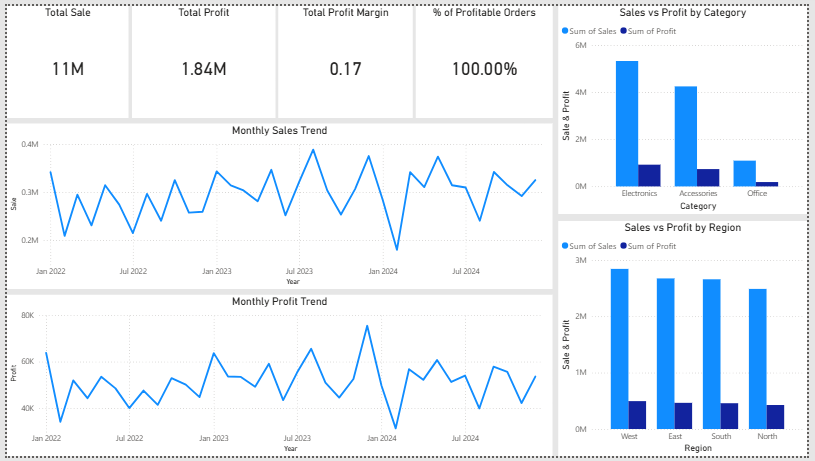

# 📊 E-Commerce Sales Data Analysis

## 🧠 Project Overview
This project analyzes an **e-commerce sales dataset** to extract
**business-driven insights** related to sales performance, profitability,
product categories, and regional trends.

The analysis focuses on identifying patterns, inefficiencies, and
actionable insights useful for business decision-making.

---

## 📂 Dataset
The dataset contains the following key fields:

- Order Date  
- Product Name  
- Category  
- Region  
- Quantity  
- Sales  
- Profit  

---

## 🛠️ Tools & Technologies
- **Python** (Pandas, NumPy, Matplotlib, Seaborn)
- **SQL-style analysis** simulated using Pandas
- **Google Colab**
- **Power BI** (Dashboard creation)

---

## 🔄 Project Workflow
All analysis steps were executed in a **single Jupyter Notebook**:

- Data Loading & Understanding  
- Exploratory Data Analysis (EDA)  
- Feature Engineering & Data Cleaning  
- Visualization & Business Insights  
- SQL-style Analysis & Dashboard Dataset Preparation  

---

## 📊 Key Business Insights
- Sales show **clear seasonal trends** with identifiable peak months  
- Higher sales volumes do **not always translate into higher profit**  
- Certain regions and product categories consistently generate losses  
- Profit margin analysis reveals **pricing and cost inefficiencies**  
- Loss-making products were identified for corrective business actions  

---

## 📈 Power BI Dashboard

The dashboard was created using aggregated outputs from the Python analysis to communicate insights clearly to business stakeholders.

**Included files:**
- 📁 `dashboard/Dashboard.pbix`
- 🖼️ `dashboard/dashboard_preview.png`

**Dashboard components:**
- KPI Cards: Total Sales, Total Profit, Profit Margin  
- Line Chart: Monthly Sales & Profit Trends  
- Bar Charts: Sales & Profit by Region and Category  
- Table: Top Loss-Making Products  

---

## 📁 Repository Structure

ecommerce-eda-python/
│

├── dashboard/

│ ├── Dashboard.pbix

│ └── dashboard_preview.png

├── data/

│ └── ecommerce_sales_data.csv

├── notebook/

│ └── ecommerce_sales_analysis.ipynb

├── dashboard_month.csv

├── dashboard_region.csv

└── README.md

---

## ✅ Project Status
**Completed**

---

## 👤 Author
**Vaishnavi Yadav**  
Aspiring Data Analyst  
📍 Python | Data Analysis | Business Insights  

---

⭐ *If you found this project useful, feel free to star the repository!*
